# 100x Your Life with an AI Team

**Reclaim your presence. Build an AI team. Move at the speed of creativity.**

You know AI could transform your work. You've heard about automation tools but they're too complex. You can see the value of AI employees but don't know how to build them.

This gives you a team of AI employees that builds itself. You describe what you need in plain English. The AI generates the agent, you review the code, and your workforce grows. Every agent can create new agents when it hits a limitation.

---

## 🎯 What You Get

A team of AI employees helping you execute on your visions. Move at the speed of creativity.

Specifically:

- Every conversation and meeting gets processed, extracting commitments with context
- Your knowledge base stays current without manual updates
- Agents recognize their limitations and request new capabilities
- They learn from patterns to improve their own performance

Your AI team handles the cognitive load while you focus on decisions and creative work.

## 📖 README-Driven Development

**Important:** We're documenting the complete vision before full implementation. Not all described functionality exists yet—see the [Progress Table](#-current-progress) below for what's actually built.

## 🔄 The 100x Framework

The framework follows a three-stage progression from personal efficiency to world-changing leverage. For the complete philosophy and detailed examples at each stage, see the [100x Framework](context/100x-framework.md).

```mermaid
graph LR
    A[📋 1x: Efficiency<br/>Organize Data] --> B[👥 10x: Capacity<br/>Build AI Team]
    B --> C[🎨 100x: Creativity<br/>Execute Visions]
    style A fill:#fff3cd
    style B fill:#d1ecf1
    style C fill:#d4edda
```

### **📋 1x → Efficiency**

Achieving 100% baseline by organizing your data and knowledge. Building a clean, human-readable knowledge base that eliminates chaos before adding automation. **Organization before automation.**

### **👥 10x → Capacity**

Building an AI team where before there was only you. Specialized agents handle commitment tracking, memory management, research, and documentation while you focus on decisions and strategy. **One person becomes a team of ten.**

### **🎨 100x → Creativity**

Having an AI execution partner that turns visions into reality. Whether launching ventures, coordinating social impact, or validating research—the AI handles analysis, development, and deployment. **Go from idea to working prototype in days, not months.**

## 🔨 The Core Insight: Self-Building AI Workforce

This isn't just AI automation—it's an AI workforce that builds itself.

**How it works from your perspective:**

You interact through your existing project management tool (ClickUp, Asana, Linear). Create a task, assign it to your AI team, and watch it get done. When your AI team encounters something it can't do yet, it creates a new agent to handle it—then gets you to review the code before deploying.

**The magic:** Every agent can recognize its limitations and request new capabilities. Your AI workforce evolves with your needs instead of staying frozen in time.

## 📊 Current Progress

This table shows actual implementation status versus planned functionality:

| Phase                              | Component                    | Status         | Description                                   |
| ---------------------------------- | ---------------------------- | -------------- | --------------------------------------------- |
| **Phase 0: Foundation**            |                              |                |                                               |
|                                    | Repository Setup             | ✅ Complete    | Tooling, AI rules, pre-commit hooks, CI/CD    |
|                                    | Agent Infrastructure         | ✅ Complete    | Pydantic AI, OpenRouter, Logfire, Jinja2      |
|                                    | BaseAgent Framework          | ✅ Complete    | .agent.md files, parser, execution            |
|                                    | Agent Validation             | ✅ Complete    | Full validator with pre-commit hook           |
|                                    | CLI Interface                | ✅ Complete    | Beautiful Click+Rich commands                 |
| **Phase 1: Interaction Layer**     |                              |                |                                               |
|                                    | ClickUp Provider             | ⬜ Next        | Task monitoring, status updates, comments     |
|                                    | Piper the Chief of Staff     | ⬜ Next        | Receives tasks, shows progress, coordinates   |
|                                    | Agent Registry               | ⬜ Next        | Simple discovery and capability matching      |
| **Phase 2: Self-Building System**  |                              |                |                                               |
|                                    | Forge the Coder              | ⬜ Future      | Creates agents from ClickUp task descriptions |
|                                    | Git/gh CLI Integration       | ⬜ Future      | Branch and PR creation via CLI tools          |
|                                    | Self-Improvement Logic       | ⬜ Future      | Agents requesting enhancements                |
| **Phase 3: Knowledge Layer**       |                              |                |                                               |
|                                    | Maya the Memory Keeper       | ⬜ Not Started | Knowledge base maintenance from conversations |
|                                    | Limitless Integration        | ⬜ Not Started | Personal conversation processing              |
|                                    | Fireflies Integration        | ⬜ Not Started | Meeting transcript analysis                   |
|                                    | Notion Provider              | ⬜ Not Started | Knowledge base storage and retrieval          |
|                                    | Winston the Wolf             | ⬜ Not Started | Privacy protection and data cleanup           |
| **Phase 4: Commitment Management** |                              |                |                                               |
|                                    | Sarah the Commitment Manager | ⬜ Not Started | Commitment extraction and tracking            |
|                                    | Task Creation Logic          | ⬜ Not Started | Smart routing and assignment                  |
|                                    | Progress Monitoring          | ⬜ Not Started | Active tracking and escalation                |

Legend: ✅ Complete | 🚧 In Progress | ⬜ Not Started

## 🛠️ Technology Choices

Built with modern, proven technologies:

- **Python 3.13+** with async support and type hints
- **Pydantic AI** for structured agent outputs and LLM interactions
- **OpenRouter** for unified LLM access (see ai/core/openrouter.py for models)
- **Celery + Redis** for task queue and caching
- **Logfire** for comprehensive observability
- **Click + Rich** for beautiful CLI tools
- **Git + gh CLI** for version control and pull request creation
- **Docker** for consistent deployment

**Post-MVP additions:** FastAPI (webhooks), PostgreSQL (database), Django Admin (UI)

## 🎯 How It Works

Your conversations and meetings flow through agents that extract what matters:

```mermaid
graph TB
    A[🎙️ Conversations<br/>Limitless, Fireflies] --> D[🤖 Agents Extract<br/>Commitments & Context]
    B[📧 Messages<br/>Email, WhatsApp] --> D
    C[📄 Documents<br/>Dropbox, Drive] --> D
    D --> E[📚 Knowledge Base<br/>Notion: People, Projects, Intelligence]
    D --> F[✅ Tasks Created<br/>ClickUp: Commitments & Actions]
    style D fill:#e1f5ff
    style E fill:#d4edda
    style F fill:#fff3cd
```

**Data sources:**

- Wearable recordings (Limitless AI)
- Meeting transcripts (Fireflies AI)
- Communication (Email, WhatsApp, Telegram)
- Documents (Dropbox, Google Drive)
- Project management (ClickUp/Asana/Linear)
- Knowledge bases (Notion/Obsidian/Confluence)

## 🚀 Your Path Forward

### Start Using It

1. **Connect your tools** - Link your project management system (ClickUp/Asana/Linear)
2. **Create your first task** - Assign something to your AI team
3. **Watch it work** - See progress updates and results in real-time
4. **Request new capabilities** - Need something it can't do? Just ask and review the PR

### Watch It Grow

Your AI workforce evolves with you:

- Agents recognize patterns and create specialized helpers
- Capabilities improve from real-world experience
- New agents emerge from identified gaps
- You spend time on creative decisions, not implementation details

## 📚 Documentation

The [100x Framework](context/100x-framework.md) explains the philosophy and progression from 1x → 10x → 100x.

For detailed architecture, agent specifications, and implementation guides, explore the [context/](context/) folder.

## 💡 Core Principles

These principles emerged from real implementation challenges:

- **Self-evolution over features** - Create capabilities when you need them, not based on prediction
- **Agent-first design** - Autonomous agents that communicate and evolve, not predetermined workflows
- **Data-first architecture** - Store everything raw, let multiple agents extract different insights
- **Human oversight** - All agent creation flows through pull requests for review
- **Heart-centered AI** - All agents use [heart-centered-prompts](https://github.com/TechNickAI/heart-centered-prompts) to operate from compassion, recognize when to offer emotional support vs. analysis, and treat interactions as mutual flourishing

## 🤝 Contributing

We welcome contributions that align with the vision of self-evolving, human-amplifying AI. See the [context/](context/) folder for detailed architecture and implementation guides.

## 📝 License

See [LICENSE](LICENSE) for details.

---

_From a place of universal love, we're building AI that amplifies human potential._

